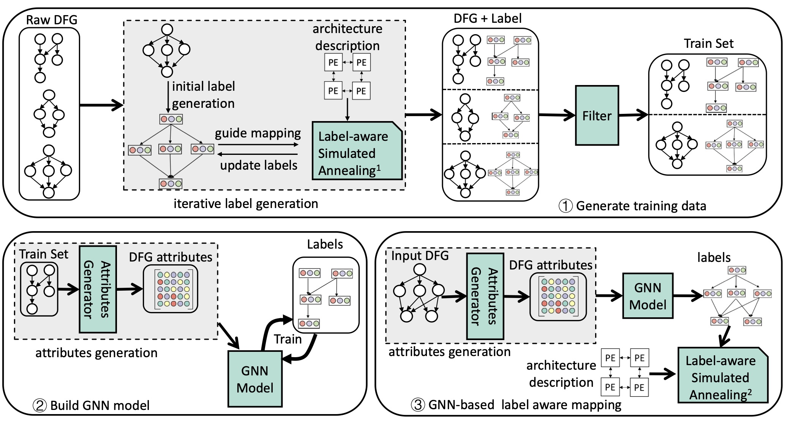

# LISA
LISA,  <ins>**L**</ins>earning <ins>**I**</ins>nduced mapping for <ins>**S**</ins>patial <ins>**A**</ins>ccelerators,  is a portable framework to map DFG (dataflow graph, representing an application) on spatial accelerators. For a new spatial accelerator, LISA can automatically tune its parameters to adapt to the accelerator characteristics to generate high quality mapping.  Please find the [paper](https://www.comp.nus.edu.sg/~tulika/HPCA_LISA_2022.pdf) for more rerefence.


## Table of contents
1. [Overview](#overview)
    1. [Directory Structure](#directory-structure)
    2. [API and scripts](#api-and-scripts)
2. [Getting Started](#getting-started)
    1. [Requirement](#requirement)
    2. [How to install](#how-to-install)
    3. [Running Example](#running-example)
3. [Portability- The workflow to use LISA for a new accelerator](#portability)
3. [Reference](#publication)


# Overview

This picture shows the whole frameowork:

 \
Overview of LISA framework: 1. Generate training data 2. Build GNN Model. 3. GNN-based label-aware mapping.


### Directory Structure
We implment the mapper component in [CGRA-ME](https://cgra-me.ece.utoronto.ca/). GNN-related stuff is stored in `lisa_gnn` folder.
```
lisa
│   README.md
│   lisa_mapper.patch
│   overview.jpg
└───lisa_gnn  (GNN related stuff: train dataset, GNN model, and DFG generator)
│   │
│   │───data (graph data and label data)
│   │   │    label_filter.py
│   │   │─── cgra_me (graph data for CGRA-ME)
│   │   │   |───  cgra_me (random graphs in CGRA-ME format)
│   │   │   |───  graph  (random graphs generated by DFG_generator, it is a standarded format)
│   │   │   └───  transformered_graph  (graph attributes generated by Attributes Generator)
│   │   │
│   │   │─── labels  (traning label data. We provide some examples.)
│   │   │   |─── cgra_me_3_3 (3x3 CGRA label, and CGRA is modeled by CGRA-ME)
│   │   │   └─── cgra_me_4_4 (4x4 CGRA label, and CGRA is modeled by CGRA-ME)
│   │   │
│   │   │─── infer (the directory to store temporary DFGs.)
│   │   │
│   │───dfg_generator (Generate train set)
│   │   │
│   └───lisa_gnn_model (GNN models)
│   │   │─── gnn_inference.py
│   │   │─── run_training.sh
│   │
└───cgra_me (Not included in the original github repo. Need to download it)
        | call_gnn.sh
        | run_exper.py

```
### API and scripts
* gnn_inference.py: This python file has two arguments: graph name and architecture name. Example: ``python gnn_inference.py 0VIHB3KrVi cgra_me_4_4``. The grpah is stored in  ``lisa/lisa_gnn_model/data/infer/0VIHB3KrVi.txt``. And ``cgra_me_4_4`` represents the arch name.
* run_training.sh: This shell file builds all the GNN models for a given accelerator. For  example: ``bash run_training.sh cgra_me_4_4``
* call_gnn.sh (in ``cgra_me``): The script to call GNN inference through invoking gnn_inference.py.  It has two arguments: graph name and architecture name.
* run_exper.py (in ``cgra_me``): ``python run_exper.py method target_arch dfg_type cpu_core_number`` \
-method: gnn_lisa, gnn_training_data, baseline. 'gnn_lisa' represents LISA mapping (gnn-based label-aware mapping), gnn_training_data means generate labesl for train set, baseline incldues ILP and SA. \
-target_arch: We have evaluated LISA on 6 accelerators as mentioned in Section VI, page 9. We use index 0-6 to represent these accelerators. 0: 4x4 CGRA; 1: 3x3 CGRA; 2: 4x4 CGRA with less routing resource; 3: 4x4 CGRA with less memory connectivity; 4: 8x8 CGRA; 5: systolic array. \
-dfg_type: 0 or 1. O reprsents original DFGs, and 1 is unrolled DFGs. \
-cpu_core_number: if you are running gnn_lisa, make sure at least 13 CPU cores are available. For baseline,  make sure at least 26 CPU cores are available.


# Getting started
## Requirement:
* Ubuntu (we have tested Ubuntu 16.04 and 18.04)
* We provide two ways to install LISA:
  1) Build on your machine. You need to install Anaconda and [CGRA-ME](https://cgra-me.ece.utoronto.ca/) related dependencies.
  2) Use Docker.

## How to install

### Build on your machine
* Download source code: ``$ git clone --recurse-submodules  https://github.com/ecolab-nus/lisa.git``.
* Make sure you have installed **Anaconda**.
* Go to ``lisa`` directory. Create LISA environment with: ``$ conda env create -f lisa.yml``.
* Download [CGRA-ME](https://cgra-me.ece.utoronto.ca/) into ``lisa/`` (the location of github repo) and rename as ``cgra_me``. Please follow the tutorial in CGRA-ME to install dependencies, build it, and run the example.
* Apply our mapper patch for CGRA-ME (in ``lisa/cgra_me``):  ``$ patch -p1<../lisa_mapper.patch``. Rebuild cgra_me.

### Build with Docker
* Download the [docker file](https://github.com/ecolab-nus/lisa/blob/main/Dockerfile) and [conda envireonment](https://github.com/ecolab-nus/lisa/blob/main/lisa.yml). Create an empty folder and put the above two files into the folder.
* Build lisa image: ``$ docker build ./ -t lisa``. This takes around 15 minutes.
* Initalize: ``$ docker run --name lisa_ae -it lisa``
* Start the container: ``$ docker start lisa_ae``
* Get into the container: ``docker exec -it lisa_ae /bin/bash``
* Download [CGRA-ME](https://cgra-me.ece.utoronto.ca/), decompress it into ``/home/lzy/lisa/``, and rename as ``cgra_me``. As we have installed all the software dependencies in the docker image, downloading CGRA-ME is enough.
* Apply our mapper patch for CGRA-ME (in ``lisa/cgra_me``):  ``$ patch -p1<../lisa_mapper.patch``
* Build new CGRA-ME (in ``lisa/cgra_me``): 1) Activate environment: ``$ ./cgrame_env``. 2) Build: ``$ make -j``


## Running Example:
We provide an example to map DFG using LISA. \
To reproduce the results, please check the appendix of our paper: **LISA: Graph Neural Network based Portable Mapping on Spatial Accelerators**.


### Map DFG using LISA
We use CGRA_ME and 4x4 CGRA for the follwing examples. Here, we show how to map one DFG with LISA, i.e., GNN-based label-aware mapping, assuming we have generated the training data set and build GNN model.

1. Go to cgra_me directory (lisa/cgra_me). Activate environment by ``./cgrame_env``.
2. Activate environment: ``conda activate lisa``
3. Run the mapper. ``$CGRA_MAPPER -m 2 --II 20 --inef --arch_name cgra_me_4_4 -g ./benchmarks/polybench/cholesky/my_graph_loop.dot  --xml ./arch/simple/target_arch/arch-homo-orth_4_4.xml --cgra_x 6 --cgra_y 6`` (Note, as the outmost PEs in this arch are I/O ports, we mark the CGRA as 4x4 CGRA though it has 6x6 size.)


# Portability 
**The workflow to use LISA for a new accelerator.**

Let us say we have a new accelerator- 8x8 CGRA in CGRA-ME. And we name it as cgra_me_8_8. We have created this arch in cgra_me ( ``cgra_me/arch/simple/target_arch/arch-homo-orth_8_8.xml ``).

## Generate GNN train set for LISA.
* Generate training graph (lisa/lisa_gnn/dfg_generator): ``$ python dfg_generator.py -n 1000  ``. You can skip this step, as all the architectures in cgra-me share the same graphs.
* Generate training labels (lisa/cgra_me): ``$ python run_exper.py gnn_training_data 1 1000``. All the labels will be generated under folder ``lisa_gnn/data/labels/cgra_me_8_8/``. This step is very time-consuming, where each label can take around hours. See [API and Scripts](#api-and-scripts) to utilize more cores and set which DFGs to train.
* Filter labels and generate train set(in lisa/lisa_gnn/data): ``$ python label_filter.py -r cgra_me/transformered_graph/ -l cgra_me_8_8``. This will generate a train set ``cgra_me_8_8`` in ``data/training_dataset/`` directory

## Build LISA GNN Models.
* Activate lisa environment: ``$ conda activate lisa``.
* Train GNN model (lisa/lisa_gnn/lisa_gnn_model): ``$ bash run_training.sh cgra_me_8_8``. GNN model will be saved in each label directory.

## Map using GNN-derived label

* Activate the environment and run the mapper: ``$CGRA_MAPPER -m 2 --II 20 --inef --arch_name cgra_me_8_8 -g ./benchmarks/microbench/conv2/my_graph_loop.dot --xml ./arch/simple/target_arch/arch-homo-orth_8_8.xml --cgra_x 10 --cgra_y 10``

# Publication

```
@inproceedings{li2022lisa,
  title={LISA: Graph Neural Network based Portable Mapping on Spatial Accelerators
},
  author={Li, Zhaoying and Wu, Dan and Wijerathne, Dhananjaya  and Mitra, Tulika},
  booktitle={2022 IEEE International Symposium on High-Performance Computer Architecture (HPCA)},
  year={2022},
  organization={IEEE}
}
```